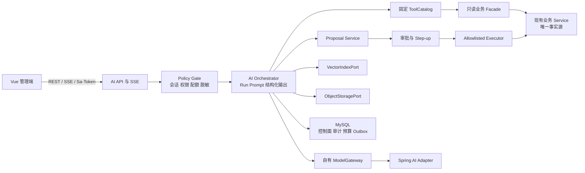

# 现代 AI 智能学生宿舍管理系统总计划

> 状态：阶段 0-6 后端/数据/安全能力已实现；9 图 UI 高保真 Stage 6 已完成 2026-08-09 用户 Dashboard 反馈整改、工程复验和用户肉眼验收；生产发布尚未批准。
> 基线日期：2026-08-09。
> 适用范围：Java 21 + Spring Boot 3.5.16 模块化单体、Vue 3 管理端、MySQL、Redis、Sa-Token/RBAC。
> 视觉合同：`design/ai-prototypes` 下 9 张最终 PNG；各图约束对应页面主体/组件，共享壳层按统一合同收敛；不再等待 Figma，不重新生图。

本文是项目现行的能力、架构、阶段和视觉总计划。详细数据与接口见 [AI 数据、接口与事件契约](./ai-data-contract.md)，安全边界见 [AI 安全、隐私与审批边界](./ai-security.md)，验证证据见 [AI 验证与验收](./ai-verification.md)，运行处置见 [AI 运行手册](./ai-operations-runbook.md)，后续编码任务使用 [现行开发提示词](./development-prompts.md)。

## 1. 计划结论

项目已从传统宿舍管理后台升级为面向管理员、宿管、后勤、维修人员和获授权审计人员的 AI 辅助管理系统。现有 MySQL、业务 Service 和 Sa-Token/RBAC 始终是业务事实与授权来源；AI 只负责授权检索、解释、固定指标查询、运营风险信号说明、维修分诊和公告草稿。

首期允许形成业务提案的 action type 只有：

- `NOTICE_CREATE_DRAFT`：创建公告草稿，不发布；payload schema 为 v1。
- `REPAIR_ASSIGN`：提出维修指派方案，不自动指派；payload schema 为 v1。

所有业务写固定经过“AI 建议 -> 变更预览 -> 人工审批 -> 现有 Service 执行”。模型不得直连业务数据库、生成或执行任意 SQL、动态注册工具、调用任意 URL/命令/脚本/文件系统，也不得绕过会话、对象范围或原业务权限。

当前结论必须分开表述：

| 项目 | 状态 | 说明 |
| --- | --- | --- |
| 非 AI 业务基线 | `COMPLETED` | 18 个原业务路由、19 张业务表及既有 CRUD/状态流继续有效 |
| AI 阶段 0-6 后端/数据/安全实现 | `COMPLETED` | 控制面、知识/RAG、固定指标、提案审批、风险和运行治理已落地 |
| 9 图 UI 高保真落实与复验 | `COMPLETED` | 2026-08-09 Dashboard 圈注的固定类别色、右侧风险层级、待办七列字段和受权限约束的双操作已整改；Stage 6 全新候选链、工程门、独立 UI/安全复核和用户肉眼验收均已完成 |
| 后端/数据/安全工程验收 | `COMPLETED` | 当前既有后端质量门、真实本地基础设施和安全边界证据继续有效；相关源码变化后必须重跑 |
| UI 相关前端工程验收 | `COMPLETED` | 当前 Dashboard 反馈整改已通过 Vitest、typecheck、build、治理 `9/9`、Dashboard `8/8`、普通 E2E `72/72`、正式预览、同视口对照、Impeccable detector、两份独立 UI 增量复核、专项安全增量复核和用户肉眼验收 |
| Route A 本地封版与公开发布 | `COMPLETED` | 2026-08-11 已完成 Stage 0-5.5；项目以 `Apache-2.0` 发布到 [GitHub public 仓库](https://github.com/muhanking111/ai-student-dormitory-management-system)。`rc-20260811.1` 因 CodeQL 5 个告警已失效；不可移动 tag `rc-20260811.2` 和公开 Release 与远程默认分支绑定同一最终提交 |
| 生产外部依赖与发布门 | `NOT RUN / NOT APPROVED` | KMS、外部向量/对象/扫描、外部审计锚、供应商正式条款和生产灾备未验收 |
| 阶段 7 预测模型与学生端 | `OUT OF SCOPE` | 不是本轮未完成项，不得混入生产门清单 |

## 2. 当前实现真值

### 2.1 前端与页面

当前共有 `18 个原业务路由 + 4 个 AI 路由 = 22 个受保护路由`。所有非登录路由都经过 `router.beforeEach -> ensureSession() -> meta.permission`，无权限时跳转到首个可访问路由。

AI 页面不是占位：

| 页面/承载 | 路由或位置 | 当前能力 | 主要权限 |
| --- | --- | --- | --- |
| AI 智能驾驶舱 | `/` | 固定指标、运营简报、风险摘要、待处理建议 | `ai:dashboard:query` |
| 全局/上下文助手 | 应用级 Drawer / 移动全屏 Sheet | 会话、SSE、引用、停止、重试、反馈和安全拒答 | `ai:assistant:use` + 页面原 read 权限 |
| 维修智能分诊 | `/repairs` | 工单上下文、分类/紧急度/SLA/人员建议、指派提案 | `repair:read` + `ai:repair:triage` |
| 公告 AI 起草 | `/notices/create` | 纯文本草稿、PII/内容检查、预览和审批链 | `notice:read` + `ai:notice:draft` |
| 知识治理 | `/ai/knowledge` | 来源、Owner/分类/ACL、纯文本摄取、版本激活/退休、L0 公开审批 | `ai:knowledge:read` / `ai:knowledge:manage` |
| 智能风险中心 | `/ai/risks` | 确定性风险案例、解释证据、降级提示、人工处置 | `ai:risk:read` / `ai:risk:manage` |
| 待审批 | `/ai/approvals` | payload/snapshot hash、过期/变脏/needs-review 阻断、reconfirm | `ai:approval:review` + 目标业务权限 |
| 运行审计 | `/ai/audit` | 脱敏运行审计和受控 break-glass 正文读取 | `ai:audit:read` / `ai:audit:content:read` |

全局 AI 菜单以当前实际注册路由为候选集合，经过 AI 功能开关和逐路由 RBAC 后生成；原型图中的不同 AI 菜单文字、数量与顺序只是阶段性构图，不形成页面级菜单合同。共享壳层只保留一套，不因进入 Dashboard、维修、公告、风险、审批或审计页面而切换。

上述表说明现有执行入口和后端能力持续有效。2026-07-27 的 AI-live、六视口与 `visual-final-20260727-f` 只保留为历史结构证据；2026-08-04 `ew/ex/ey/ez/fa/fb/fc` 因 Dashboard 源码变化降级为整改前基线。本轮当前工程证据绑定用户圈注整改源码、`stage5-governance-20260809-dashboard-feedback-k`、`stage6-final-preview-verification-20260809-dashboard-feedback-l.json` 和 `stage6-dashboard-feedback-comparison-20260809-l`；2026-08-09 用户已完成肉眼验收。当前范围与状态见 `.planning/20260727-ui-prototype-texture-reassessment/`，精确证据边界见 `plan/ai-verification.md`。

前端 `apiRequest()` 对 Cookie 写请求执行 CSRF + Origin 防护；除登录和 CSRF 获取接口外，非 GET 请求自动携带 `X-CSRF-Token`。`401` 会清理 CSRF 缓存并进入统一未授权处理。

### 2.2 后端与数据

- 基础业务 schema 保持 19 张业务表；AI 控制面独立为 44 张 `ai_*` 表。
- OpenAPI 为 3.1.0，当前覆盖 `55 paths / 60 operations`。
- Spring AI 1.1.8 是已选的可替换适配器；LangChain4j 1.12.1 仅保留 test-scope 对照。
- 当前候选未运行 `RealModelContractIT`，DeepSeek 等真实供应商合同继续为 `NOT RUN / NOT APPROVED`；历史只读合同不绑定当前候选，精确边界见 [AI 验证与验收](./ai-verification.md)。
- 生产默认仍是 `AI_ENABLED=false`、`AI_PROVIDER_ACTIVE=none`、`AI_WRITE_EXECUTION_ENABLED=false`。
- MySQL 保存 run、版本、ACL、提案、审批、执行、预算、用量、审计和 outbox 的权威事实；Redis 只承担会话、短缓存和非权威并发加速。

服务端固定工具目录只有 7 个版本化工具：

| 类型 | 工具 |
| --- | --- |
| 只读 | `knowledge.search.v1`、`dashboard.query_metric.v1`、`repair.get_context.v1`、`dormitory.get_capacity_summary.v1`、`notice.list_published.v1` |
| 提案 | `repair.propose_assignment.v1`、`notice.propose_draft.v1` |

Dashboard 只允许 6 个固定指标：宿舍总数、入住学生数、空余床位、待维修、卫生待整改、未缴账单。模型只能输出受 Schema 约束的 `metricIds/date preset/dimensions/filters/presentationHint`，不能输出表名、字段名、Mapper 或 SQL。

## 3. 用户、权限与授权策略

### 3.1 AI 权限

当前权限码共 14 个：

```text
ai:assistant:use
ai:knowledge:read
ai:knowledge:manage
ai:knowledge:publish-public
ai:dashboard:query
ai:repair:triage
ai:notice:draft
ai:risk:read
ai:risk:manage
ai:approval:review
ai:audit:read
ai:audit:content:read
ai:config:manage
ai:eval:run
```

ADMIN 默认幂等补齐 12 个一般 AI 权限，但不会自动获得 `ai:knowledge:publish-public` 和 `ai:audit:content:read`。前端菜单隐藏从来不是授权边界；Controller、工具选择、审批和最终执行都必须在服务端重新鉴权并校验对象范围。

### 3.2 固定授权规则

- `REPAIR_ASSIGN`：`ai:approval:review` + ADMIN 身份 + `repair:write` + 目标对象范围。
- `NOTICE_CREATE_DRAFT`：`ai:approval:review` + `notice:write` + 目标对象范围。
- 知识 Owner 有管理责任，不天然拥有正文读取权或公开审批权。
- L0 公开版本必须由非 Owner、持有 `ai:knowledge:publish-public` 的治理人员 recent-auth 后审批固定 version/hash/ACL snapshot。
- `ai:audit:read` 只允许脱敏元数据；正文读取还需要 `ai:audit:content:read`、底层业务授权和 break-glass 理由，并追加审计。
- 不可见资源统一按 404 处理，不能用前端可见性、UUID 难猜或角色名硬编码代替对象级授权。

## 4. 全局不变量

1. 业务事实只来自现有业务 Service 或受控只读 Facade。
2. AI application 不依赖业务 Mapper、`JdbcTemplate` 或供应商 SDK 类型。
3. 模型循环不注册业务写工具；提案工具只写 AI 控制面。
4. 审批和执行分离；`APPROVED` 不等于业务成功，只有 execution `SUCCEEDED` 才算成功。
5. 每次工具调用、SSE 重连、审批、reconfirm 和执行都重新检查当前会话、账号、权限与对象范围。
6. 知识 ACL 默认拒绝；空 ACL 不表示公开，Owner 管理权不表示正文读取权。
7. 进入外部模型的数据按场景最小化、脱敏或令牌化；姓名、学号、手机号默认不得进入模型。
8. 事实性回答必须关联本次 run 已记录且当前可访问的引用；没有可靠来源时明确拒答。
9. 模型输出只按纯文本渲染；禁止 `v-html`，禁止把模型自由文本直接当动作参数。
10. 审计、预算或用量事实不能写入时，默认拒绝启动新 run 或拒绝确认写执行。
11. AI 关闭、超时、限流或供应商故障时，原业务页面和人工流程必须继续可用。
12. 风险只表示确定性运营信号，不得形成学生纪律、心理、健康、信用或个体预测画像。

## 5. 实现架构



### 5.1 模块边界

- `ai.api`：REST、SSE、DTO、稳定错误码、CSRF/Origin 接入。
- `ai.application`：编排、策略、提案、审批、执行、知识、风险和评测用例。
- `ai.domain`：状态机、Schema、hash、预算、授权与审计不变量。
- `ai.infrastructure`：Spring AI、MySQL、Redis、对象/向量适配器和 worker。
- `BusinessToolPort` / actor-aware Facade：复用原 Service 的业务规则和行级范围。

首期保持模块化单体和 Spring MVC；SSE 使用两步协议：POST 创建 run，GET `text/event-stream` 消费持久化批次事件。进程重启导致内存中的认证上下文丢失时，未完成 run 失败或取消，不能仅凭数据库 permission digest 恢复工具执行。

### 5.2 供应商与存储边界

- 业务层只依赖自有 `ModelGateway`、`EmbeddingGateway`、`VectorIndexPort`、`ObjectStoragePort`。
- 未激活适配器不要求 secret；启用适配器缺失必要 secret 时该 AI 能力 fail fast，但总开关关闭不能阻断非 AI 应用启动。
- MySQL 是 ACL、版本、hash、审批和审计事实源；向量与对象数据是可重建副本。
- 外部对象必须通过隔离 upload session、固定 version/ETag、服务端 checksum 和恶意文件扫描后才能进入摄取。

## 6. 能力合同

| 能力 | 当前承诺 | 安全降级 |
| --- | --- | --- |
| 知识助手 | 从当前用户可访问的 READY 版本检索，展示版本化引用 | 无可靠引用时拒绝确定性回答；向量故障时退化为授权关键词检索 |
| 全局/上下文助手 | 页面只提交 context type/ID，服务端重取并裁剪上下文 | 权限撤销或上下文过期时停止后续工具并要求刷新 |
| 自然语言 Dashboard | 映射到固定指标目录与预编译 handler，返回口径和 as-of | 无法映射时列出支持项，不猜测 SQL |
| 维修分诊 | 分类、紧急度、SLA、理由、缺失信息和候选维修员 | 模型不可用时显示规则结果；无候选、低置信、已完成或无权限时禁提案 |
| 公告起草 | 生成可编辑纯文本草稿，执行 PII/内容检查并保留引用 | 无来源不生成确定性政策内容；检测到 PII/脚本内容时阻断 |
| 风险中心 | 汇总确定性运营信号，AI 只解释和排序 | 模型失败时继续展示规则证据；任何人工结论 append-only |
| 审批与审计 | 显示差异、权限、风险、版本/hash、成本与执行时间线 | stale/expired/无权限/审计不可用时禁批；不静默重试业务写 |

## 7. 状态机

### 7.1 AI Run

`ACCEPTED -> QUEUED -> RUNNING -> STREAMING -> SUCCEEDED`

- 运行态可进入 `CANCELLED`、`FAILED`、`TIMED_OUT` 或 `DEGRADED`。
- 所有终态不可回退；重试创建新 run 并通过 `parent_run_id` 关联。
- 流式期间会话或权限撤销时停止后续工具和敏感事件。

### 7.2 知识版本

`REGISTERED -> PARSING -> CHUNKING -> EMBEDDING -> READY -> RETIRED`

- 处理态可进入 `RETRYABLE_FAILED`；恶意文件、解析不可信或 ACL 缺失进入 `QUARANTINED`。
- 只有完整版本通过索引和抽检后才能原子切换 `current_version_id`。

### 7.3 提案、审批与执行

`DRAFT -> PENDING_APPROVAL -> APPROVED -> EXECUTING -> SUCCEEDED`

- `PENDING_APPROVAL` 可进入 `REJECTED / EXPIRED / CANCELLED / STALE`。
- payload、权限或业务 snapshot 变化时进入 `STALE`，必须重新预览。
- execution 进程中断进入 `NEEDS_REVIEW`；只有新会话中的真实有权用户可以 reconfirm。
- 结果不确定时保持人工审查，不自动新建 attempt 或让模型修改参数重试。

### 7.4 风险案例

`OPEN -> ACKNOWLEDGED -> RESOLVED`，或 `OPEN/ACKNOWLEDGED -> DISMISSED`。

规则再次命中时按 version/CAS re-open 或创建关联新案例；之前的人工结论和事件不得被覆盖。

详细枚举、合法前态和数据约束以 [AI 数据契约](./ai-data-contract.md#状态枚举) 为准。

## 8. 阶段路线与状态

| 阶段 | 交付范围 | 当前状态 | 主要验收 |
| --- | --- | --- | --- |
| 0 技术与治理门 | 框架 Spike、端口边界、产品/安全决策、默认关闭 | `COMPLETED` | Spring AI、本地 Stub、框架兼容及安全默认值；当前真实模型合同未运行 |
| 1 AI 控制面 | 44 张 AI 表、14 权限、REST/SSE、审计、预算、Outbox、前端协议 | `COMPLETED` | OpenAPI、schema、权限、幂等、CSRF/Origin |
| 2 安全摄取/RAG/助手 | upload session、ACL、注入/PII、引用、助手 UI | `COMPLETED` | deny-empty、引用重鉴权、纯文本、桌面/移动助手 |
| 3 固定指标 Dashboard | 6 指标、结构化意图、确定性执行器、图表 | `COMPLETED` | 无动态 SQL、权限/低置信/无来源和 Canvas 验证 |
| 4 提案/审批/维修/公告 | proposal、step-up、lease、reconfirm、两类写动作、页面 | `COMPLETED` | snapshot/hash、并发、过期、无绕审批业务写 |
| 5 风险闭环 | 确定性信号、解释、人工事件、风险 UI | `COMPLETED` | 无画像、状态机、权限、规则降级 |
| 6 运行治理 | eval、红队、预算、熔断、Kill Switch、运行手册、全量门 | `COMPLETED` | 自动化、真实基础设施、E2E、视觉、安全、供应链 |
| UI 高保真复验 | 设计系统、全部 AI 承载页、完整交互/异常/权限状态、六视口和可访问性 | `COMPLETED` | 2026-08-09 用户已确认“看现在ui差不多还可以”；当前候选链完成 Dashboard 反馈整改、六视口/200%、状态画廊、同视口比较、Assessment A/B、专项安全和完整性复算 |
| 7 预测模型与学生端 | 个体预测、学生自助面 | `OUT OF SCOPE` | 未来独立立项，不在本计划内 |

阶段 0-6 的后端与控制面能力不从零重做；UI 高保真复验按当前源码做增量纠偏。旧截图、旧 hash、结构合同、无溢出或 Canvas 非空不得直接宣称视觉通过；只有对应页面的新实现、新截图、逐元素关闭记录、独立 UI 审查和用户验收可以关闭本轮 UI 状态。2026-08-09 用户以 Dashboard 左右圈注图指出固定类别色、风险信息层级、待办字段密度和审批入口偏差，整改后已由用户确认通过；2026-08-04 的 `ew/ex/ey/ez/fa/fb/fc` 只保留为整改前基线，当前唯一高保真候选为 `20260809-dashboard-feedback-l`。

2026-08-09 当前工程候选链已更新为 `dist-stage6-prod-misflag-20260809-dashboard-feedback-l`、`stage6-accessibility-20260809-dashboard-feedback-l-accessibility-accessibility`、`visual-stage6-20260809-dashboard-feedback-l`、`stage6-comparison-20260809-dashboard-feedback-l`、`stage6-review-sheets-20260809-dashboard-feedback-l`、`stage6-external-evidence-20260809-dashboard-feedback-l` 和 `stage6-candidate-integrity-20260809-dashboard-feedback-l.json`；完整性复算 `2337` 项通过，用户已完成肉眼确认，Stage 6 与 UI 高保真复验完成。

## 9. 9 张最终 PNG 视觉合同

PNG 决定各自页面主体或组件的结构、信息层级、尺寸关系、组件风格、颜色、密度和响应式；功能、安全、权限和数据语义由本计划及数据/安全契约优先约束。多图中重复出现但彼此不一致的 Sidebar/Header 按共享壳层合同解释，不能产生逐页变体。图片中的日期、模型别名、case ID、hash、数字、示例文案及阶段性菜单不是业务事实。

| 最终 PNG | 逻辑承载 | 必须保留的交互/安全状态 |
| --- | --- | --- |
| `ai-dashboard-desktop.png` | `/` 桌面驾驶舱 | 命令栏、KPI、简报、趋势、风险、待办；低置信/无来源；只进入预览/审批 |
| `ai-dashboard-mobile.png` | `/` 390px 响应式 | 52px 折叠 Sidebar、两列统计、单列内容、首屏风险、无全页横向滚动 |
| `ai-assistant-desktop.png` | 右侧约 480px Drawer；只约束助手 | 流式、停止、重试、反馈、引用可用/拒绝、关闭确认和焦点恢复；不覆盖底层 Dashboard |
| `ai-assistant-mobile.png` | 390px 全屏 Sheet；只约束助手 | 固定头/输入、引用折叠、停止始终可达、safe-area 和无横向溢出 |
| `ai-repair-triage-desktop.png` | `/repairs` | 列表+详情、分诊证据、候选来自真实业务选项、三段审批链、阻断态 |
| `ai-notice-drafting-desktop.png` | `/notices/create` | 要点/语气、纯文本草稿、PII 检查、diff、仅草稿、人工发布锁定 |
| `ai-risk-center-desktop.png` | `/ai/risks` | 四类运营风险、规则证据、人工时间线、“不代表学生评价”、不自动处置 |
| `ai-approval-audit-desktop.png` | `/ai/approvals` 与 `/ai/audit` | 差异、hash、过期、权限、运行时间线；`SUCCEEDED` 才算业务成功 |
| `ai-design-system.png` | 全局令牌与 `components/ai/` | 状态不只靠颜色、纯文本引用、固定审批条、focus/loading/disabled 状态 |

### 9.1 共享壳层与原图冲突处理

- `AppSidebar`、`AppHeader`、`AppLayout` 是全站唯一共享壳层；当前源码和新鲜测试采用桌面 Sidebar 展开 `208px`、折叠/移动 `52px`、Header `64px`，页面不得自行覆盖。
- `ai-design-system.png` 内嵌的 `240px Sidebar` 属于已被运行证据取代的原始标注；旧文档中的移动 `72px` 同样不再生效。两者都不能用于覆盖 `208/52/64` 共享壳层合同。
- AI 菜单以实际注册的 `/ai/knowledge`、`/ai/risks`、`/ai/approvals`、`/ai/audit` 等路由为候选，并同时执行 AI 功能开关和对应 RBAC 过滤；原型菜单不新增路由、不授予权限。
- 原始桌面图的 Sidebar 实测分别为 Dashboard 207px、Assistant 185px、Repair 202px、Notice 254px、Risk 223px、Approval/Audit 224px；移动 Dashboard 为 105px/852px 画布，折算到 390px 约 48px。这些差异只证明原图构图不统一，不是按页面切换尺寸的依据。
- Dashboard 两张图只约束 Dashboard 主体；Assistant 两张图只约束 Drawer/Sheet。Assistant 桌面图里的 Dashboard 是背景上下文，不得覆盖 Dashboard 专用图。
- Assistant 候选 v1 已废弃；候选 v2 与最终 `ai-assistant-desktop.png` 相同。`candidates/` 只保存决策证据，不参与实现和验收。

### 9.2 视觉不变量

- 蓝白企业后台；桌面 Sidebar 展开 208px、折叠/移动 52px、Header 64px、AI Drawer 440-480px。
- 主色 `#2563EB`、Sidebar `#163B83`、AI accent `#6366F1`、成功 `#10B981`、警告 `#F59E0B`、危险 `#EF4444`。
- 卡片圆角 8-12px，保持低阴影；禁止霓虹科幻、重玻璃拟态、装饰性大渐变和无意义动画。
- 风险、无权限、低置信、无来源、过期、失败必须同时使用图标、文本和可访问名称，不能只靠颜色。
- 触摸目标至少 44px；长中文、错误消息和 200% 缩放不得溢出或遮挡。
- 响应式和视觉回归固定覆盖：`1920x1080`、`1366x768`、`1586x992`、`1536x1024`、`1505x1045`、`390x844`。

### 9.3 质感级高保真验收

- 每张最终 PNG 必须在对应逻辑视口与当前页面同尺度并排审查，必要时输出透明叠图或像素差分热区；只看独立截图不得关闭高保真。
- 每个关键元素记录目标与当前的字体族、字号、标准字重、行高、文字色、背景、边框、圆角、阴影、间距和图标尺寸；运行时计算样式优先于 CSS 源码推断。
- 禁止依赖 Ant Design 默认暗色菜单、半透明文字、禁用态或表单 Token。共享 Sidebar 必须覆盖父项、子项、展开、选中、hover、focus 和滚动状态；不得出现 `#000c17` 黑色子菜单块。
- 字体使用浏览器实际渲染结果验收；不使用 `550/650/750` 等平台映射不稳定的非标准权重冒充视觉精度，也不使用 text-shadow 掩盖发灰发虚。
- Design System 必须有专用状态画廊，覆盖颜色、排版、图标、按钮、输入框、AI 建议卡、引用卡、审批流程和 default/hover/focus/active/disabled/loading/error 状态。
- Assistant 必须分别覆盖桌面/移动的空态、流式、停止、完成、低置信、无来源、撤权引用、失败、取消、超时、历史和输入状态；内部 PII token 表达不得出现在用户可见文本。
- 原型示例数据只约束信息层级与密度，不得硬编码为业务事实；确定性视觉 fixture 必须显式标记，不能冒充真实生产数据或权限。
- 至少进行 Sidebar/字体与 Assistant/页面质感两份独立只读 UI assessment。任一 P0-P3 未关闭或用户肉眼验收未通过，UI 高保真保持 `IN_PROGRESS`。

## 10. 已确认产品决策

| 编号 | 决策 |
| --- | --- |
| PD-01 | 首发适配器为 Spring AI 1.1.8，供应商 DeepSeek，模型 `deepseek-v4-flash`；备用 adapter 默认禁用。 |
| PD-02 | 每个知识源必须有 Owner、L0-L3 分类和显式 ACL；空 ACL 拒绝，公开版本由非 Owner 治理人员审批。 |
| PD-03 | 首期两类低风险提案允许同一名同时具备 AI 审批权限和目标业务权限的真实用户审批；未来高风险动作另行评审四眼。 |
| PD-04 | 初始限额：每用户 10 run/分钟、并发 2、输入 16k、输出 4k、最多 5 次只读工具；MySQL 预算为硬事实源。 |
| PD-05 | 风险只含维修积压/重复报修、空床入住一致性异常和长期未处置运营待办；建议 SLA 高/中/低为 2/3/5 天。 |
| PD-06 | 9 张最终 PNG 是对应页面主体/组件的唯一视觉合同；共享壳层冲突按当前源码、新鲜测试和本计划的统一尺寸/路由规则收敛。不再使用或等待 Figma，设计提示词统一放在 `plan/development-prompts.md`。 |

## 11. 生产就绪计划

以下不是阶段 0-6 的工程缺陷，而是任何生产启用前必须补齐的外部证据。未经单独批准不得启用真实生产流量。

| 门 | 当前状态 | 交付物 | 验证与回退 |
| --- | --- | --- | --- |
| PR-01 Secret/KMS | `NOT RUN` | 生产 KMS/Secret Manager、key version/轮换/吊销、最小权限 | 缺 key 或历史 key 无法验证时 fail closed；回退为关闭 provider/写执行 |
| PR-02 向量与对象 | `NOT RUN` | 外部向量库、对象存储、恶意文件扫描、地域/加密/删除/重建证明 | ACL 前后置过滤、固定 version/ETag、扫描后覆盖攻击、删除/恢复演练 |
| PR-03 外部审计锚 | `NOT RUN` | 独立只追加介质和 receipt、checkpoint 性能方案 | 缺 receipt 告警；审计不可信时拒绝新 run/写执行 |
| PR-04 供应商合规 | `NOT RUN` | DeepSeek DPA、地域、留存/训练/删除、子处理方、退出方案 | 真实成本/延迟/限流/效果阈值；不通过则保持 provider `none` |
| PR-05 数据基础设施 | `NOT RUN` | MySQL TLS/最小权限/备份加密，Redis ACL/TLS/私网隔离 | 恢复演练、RPO/RTO、跨区灾备；开发弱配置不得进入生产 |
| PR-06 生产压测与灰度 | `NOT RUN` | 并发、预算、SSE、outbox、审计链、Kill Switch、多实例报告 | 从只读能力小流量开始；任一安全/成本门失败立即关闭对应 scope |

执行顺序固定为：外部条款与拓扑评审 -> 生产配置和密钥门 -> 真实依赖合同/恢复测试 -> 负载与故障演练 -> 只读灰度 -> 提案灰度 -> 写执行单独审批。禁止直接从本地 fake-provider E2E 跳到生产全量。

### 11.1 本地预检结论

2026-07-18 已完成不访问外部环境的生产门预检，结论如下；这些本地事实不能把任何生产门从 `NOT RUN` 改为 `PASS`：

- PR-01：AI 生产启动门已校验 Secret Manager/KMS 证据索引、密钥长度/版本、TLS、allowlist 和加密备份确认；`.env.example` 已补齐该门当前读取的主要部署输入并由契约测试约束。仓库仍没有已选定、已接入并通过轮换/吊销演练的生产 Secret Manager/KMS adapter。
- PR-02：对象存储、向量索引和扫描均有严格 Port、ACL、固定版本、隔离与 fail-closed 合同，但当前装配仍是内存对象/向量和受控纯文本扫描器；真实对象存储、向量库和恶意文件扫描产品尚未选定或验收。
- PR-03：MySQL HMAC 审计链、Merkle cutoff、HTTPS-HMAC sink 协议和 receipt 校验已实现；独立不可变介质、失败补偿/跨日补锚、receipt 新鲜度门、可信 checkpoint、删除 tombstone 联动和灾备仍缺真实目标与证据。
- PR-04：DeepSeek 技术合同不等于供应商合规；DPA、地域、留存/训练/删除、子处理方、退出方案和真实账单阈值仍需法务、安全、采购与平台输入。
- PR-05：AI 生产 fail-fast 门已覆盖 MySQL/Redis TLS、ACL、最小权限、私网、Secure Cookie 和备份加密确认；该门只在 `prod + AI_ENABLED=true` 时运行，非 AI 生产启动路径尚无同等级的全局 Secure Cookie 启动门。本地 compose 与真实基础设施测试不证明生产拓扑、加密备份恢复或跨区 RPO/RTO。
- PR-06：确定性灰度分桶、Kill Switch、预算/限流与建议灰度顺序已存在；仓库仍无获批的负载模型、生产 SLO、实例拓扑、告警面板、成本阈值、值班责任和压测/灰度报告。

进入真实实施前至少需要明确：目标云或基础设施产品、区域与网络拓扑、非生产验收账号/凭据注入方式、法务与数据处理条款、SLO/RPO/RTO/预算、灰度名单来源、告警与回滚阈值，以及允许执行外部读写测试的单独授权。在这些输入齐全前，生产默认保持 `AI_ENABLED=false`、provider `none`、写执行关闭。

## 12. 计划维护规则

1. 代码、OpenAPI、schema 和新鲜测试报告优先于旧进度文字；不能用旧数字覆盖当前事实。
2. 当前证据只在 `ai-verification.md` 维护，其他文档仅引用，避免同一测试数散落多处。
3. 新增能力先更新本计划的范围/不变量，再更新数据、安全、运行和验证文档，最后实现。
4. 新增 AI 业务写动作必须单独完成产品、安全、权限、状态机、审批和回滚评审，不能只扩 ToolCatalog。
5. 修改 9 张 PNG 对应页面时必须先用 `view_image` 查看原图并运行对应六视口合同；不调用 Figma，不重新生成视觉资产。
6. `design/ai-prototypes` 只保存原型资产和视觉索引；开发提示词只维护在 `plan/development-prompts.md`。
7. 生产门只有在真实外部环境完成并保存可复核证据后才能从 `NOT RUN` 改为 `PASS`。
8. 每个阶段开始前在活动任务计划标记 `in_progress`；交付物与验证通过后必须在同一工作会话立即更新为 `completed` 并记录证据。缺少环境、外部批准或验证失败时只能保持进行中，或标记 `blocked` / `NOT RUN` 并写明解阻条件，禁止在最终汇报时批量补状态。
